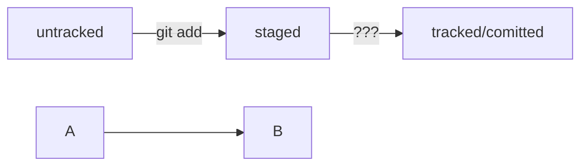
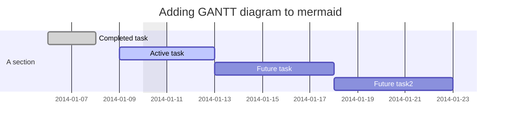

# Что мы знаем о Git

Это система контроля версий. Работает из командной строки **Git Bash**.  

Реализуются следующие команды:  

------------------------------

1. `pwd` - узнаем в какой сейчас директории находимся.
2. Для перехода в директорию вводим `cd ~`. Символ `~` - означает домашнюю директорию.
3. Вывести содержимое директории - `ls`.
4. Возвращаемся в родительскую директорию `..`.
5. Создание файлов - `touch`, создание директорий - `mkdir`.
6. Копирование файлов - `cp`.
7. Перемещение файлов и папок - `mv`.
8. Чтение файла (текстового) - `cat`.
9. Удаление файла - `rm`, удаление директории (пустой) - `rmdir`, удаление папки с файлами - `rm -r`.  

-----------------------------------

Также есть дополнительные возможности:
* Выполняйте сразу несколько команд, разделяя их `&&`.
* Используйте буфер терминала со стрелками вверх и вниз.
* Используйте _Tab_ - Автозаполнение команд. 1 раз - дополнит. 2 нажатия - выведет список возможных команд.

------------------------------------
6 спринт:
Вспомнили Git; изучили оформление коммитов
Разобрались с хешем, логом и HEAD
------------------------------------
Здесь опробуем Mermaid схему
Схема 1

Схема 2

